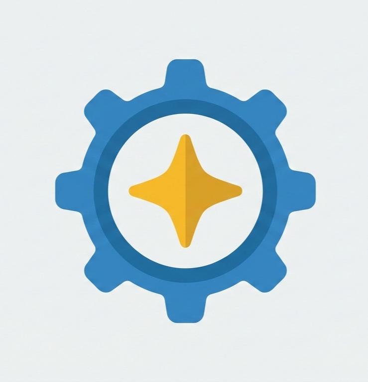

# Microsoft Rewards Bot

	
	 
	<a href="https://discord.gg/k5uHkx9mne">Join the Discord</a> · <a href="https://github.com/LightZirconite/Microsoft-Rewards-Bot/stargazers">Star the project</a>

Automates Microsoft Rewards tasks so you collect points with minimal setup.

## Install
- Install Node.js 20 or newer.
- Clone this repository.
- Run `npm install` inside the project folder.

## Setup
- Copy `src/accounts.example.jsonc` to `src/accounts.jsonc` and add your accounts.
- Adjust `src/config.jsonc` only if you want to change defaults.
- (Optional) set `DISCORD_WEBHOOK_URL` for alerts.

## Run
- `npm start` to build if needed and run once.
- `npm run dashboard` to view the web dashboard.
- `npm run dev` for local development mode.
- `npm run creator` for account creation mode (see warning below).
- `npm run docker:compose` to run in Docker.

## Modes
- Default: runs daily tasks once, then stops.
- Dashboard: serves a simple web panel to monitor runs.
- Dev: runs from source with fast restarts for editing.
- Account creation: creates new Microsoft accounts.
- Docker: runs the bot in a container with built-in scheduling.

## Account Creation Warning
- New accounts can be flagged if they earn points immediately.
- Let fresh accounts sit for a few weeks before using them.
- Use account creation mode only if you accept this risk.

## Documentation
Short guides live in `docs/index.md`.
